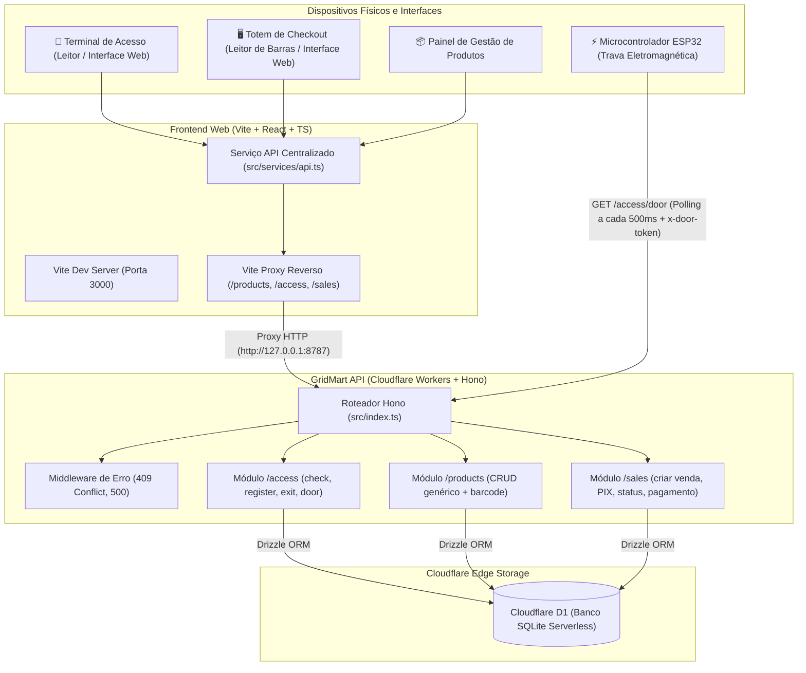
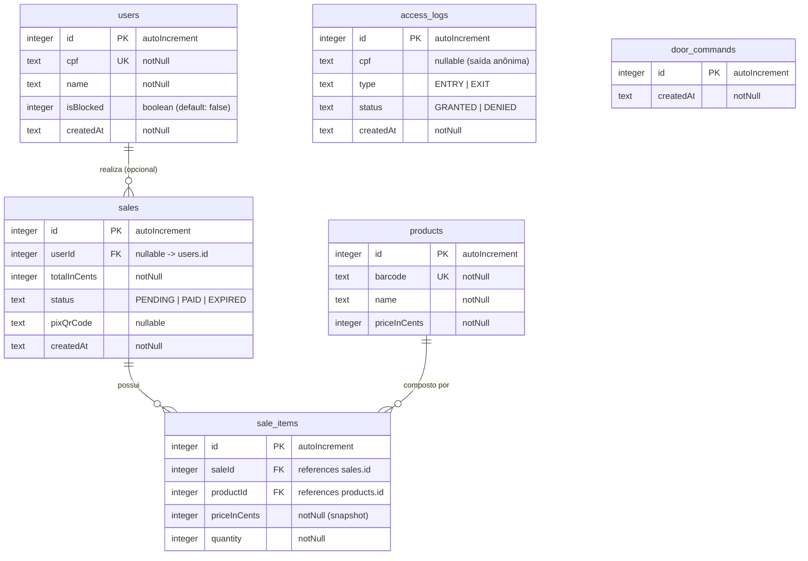

# 🛒 GridMart - Solução Integrada de Mercado Autônomo

> **Ecossistema Completo para Lojas Autônomas e Mercados Inteligentes (Honest Market / Micromarket)**  
> Abrangendo **Frontend Web (Totem & Gestão)**, **Backend API Edge-Native** e **Firmware IoT (ESP32)**.

O **GridMart** é uma plataforma ponta a ponta projetada para operar lojas físicas 100% autônomas sem a necessidade de atendentes. A solução integra três pilares fundamentais:
1. **Frontend Web**: Totem de autoatendimento para compras e pagamentos via Pix em tempo real, interface de controle de acesso (leitor de CPF para liberação de portas) e painel administrativo para catálogo de produtos.
2. **Backend API (Edge-Native)**: API de altíssima performance construída com Hono, Drizzle ORM e Cloudflare Workers com banco de dados relacional distribuído Cloudflare D1 (SQLite).
3. **Hardware & Firmware IoT (ESP32)**: Controle automatizado da trava eletromagnética da porta física da loja através de fila assíncrona de comandos com polling seguro.

---

## 📑 Índice

- [💡 Visão Geral e Conceito](#-visão-geral-e-conceito)
- [🏛️ Arquitetura Integrada do Sistema](#️-arquitetura-integrada-do-sistema)
- [🛠️ Stacks Tecnológicas](#️-stacks-tecnológicas)
- [🖥️ Módulo Frontend (`gridmart-frontend`)](#️-módulo-frontend-gridmart-frontend)
  - [Funcionalidades Principais](#funcionalidades-principais)
  - [Estrutura de Pastas do Frontend](#estrutura-de-pastas-do-frontend)
  - [Integração e Comunicação HTTP](#integração-e-comunicação-http)
  - [Configuração de Proxy e `.env`](#configuração-de-proxy-e-env)
- [🛒 Módulo Backend API (`gridmart-api`)](#-módulo-backend-api-gridmart-api)
  - [Estrutura do Backend](#estrutura-do-backend)
  - [Middlewares e Utilitários](#middlewares-e-utilitários)
  - [Novidades e Reestruturação Recente](#novidades-e-reestruturação-recente)
- [🗄️ Modelagem do Banco de Dados (Schema D1)](#️-modelagem-do-banco-de-dados-schema-d1)
  - [Diagrama Entidade-Relacionamento](#diagrama-entidade-relacionamento)
  - [Detalhamento das Tabelas](#detalhamento-das-tabelas)
- [📡 Documentação das Rotas da API](#-documentação-das-rotas-da-api)
  - [Módulo de Produtos (`/products`)](#módulo-de-produtos-products)
  - [Módulo de Acesso (`/access`)](#módulo-de-acesso-access)
  - [Módulo de Vendas (`/sales`)](#módulo-de-vendas-sales)
- [⚡ Firmware IoT e Automação da Trava (ESP32)](#-firmware-iot-e-automação-da-trava-esp32)
- [💎 Convenções e Boas Práticas Adotadas](#-convenções-e-boas-práticas-adotadas)
- [🚀 Guia de Configuração e Execução Local](#-guia-de-configuração-e-execução-local)
  - [1. Executando o Backend (API)](#1-executando-o-backend-api)
  - [2. Executando o Frontend (Web)](#2-executando-o-frontend-web)
  - [3. Testes Automatizados e Build](#3-testes-automatizados-e-build)
- [📄 Licença](#-licença)

---

## 💡 Visão Geral e Conceito

O GridMart atende aos principais fluxos de operação de uma loja física autônoma:

```
[ Entrada / Acesso ]           [ Totem de Compras ]             [ Hardware IoT ]
  Validação de CPF  ───────►   Leitor de Código de Barras  ───►    ESP32 consome
  Libera ou Cadastra           Carrinho & QR Code Pix             fila e abre trava
```

1. **Controle de Acesso da Trava da Porta**:
   - O cliente informa o CPF no terminal/leitor da entrada.
   - O sistema valida o CPF através do algoritmo oficial da Receita Federal (módulo 11) e verifica se o usuário está cadastrado e ativo (`isBlocked = false`).
   - Se autorizado, um comando de destravamento é enfileirado na tabela `door_commands` e a tentativa é registrada em `access_logs` com status `GRANTED` (ou `DENIED` caso bloqueado).
   - Se o cliente ainda não for cadastrado, a interface possibilita o cadastro instantâneo de nome e CPF, liberando o acesso em seguida.
   - Para saída, o sistema registra o log e enfileira a liberação imediata (com CPF opcional).

2. **Autoatendimento & Checkout no Totem**:
   - Busca veloz de produtos no catálogo por leitura de código de barras (`barcode`) ou seleção direta na interface.
   - Montagem do carrinho em tempo real com controle de quantidades.
   - Criação da venda vinculada aos itens, com suporte tanto para compras anônimas quanto identificadas por `userId`.
   - Geração dinâmica do **QR Code PIX** (código copia-e-cola e imagem do QR Code) via biblioteca `qrcode.react`.
   - Confirmação de pagamento manual no totem ou via webhook/integração.

3. **Gestão do Catálogo de Produtos**:
   - Criação, edição, exclusão e visualização de produtos com nome, código de barras e preços armazenados rigorosamente em centavos.

---

## 🏛️ Arquitetura Integrada do Sistema

O diagrama a seguir ilustra a comunicação entre a interface web, o microcontrolador ESP32, o backend edge-native e o banco de dados distribuído:



---

## 🛠️ Stacks Tecnológicas

### Frontend (`gridmart-frontend`)
| Tecnologia | Versão | Função no Projeto |
| :--- | :--- | :--- |
| **[React](https://react.dev/)** | `18.3.1` | Biblioteca de componentes declarativos para interface de usuário |
| **[TypeScript](https://www.typescriptlang.org/)** | `5.6.3` | Tipagem estática fim a fim com interfaces unificadas para a API |
| **[Vite](https://vitejs.dev/)** | `6.0.1` | Build tool ultrarrápido, HMR instantâneo e servidor de desenvolvimento com proxy integrado |
| **[qrcode.react](https://github.com/zpao/qrcode.react)** | `4.2.0` | Renderização nativa em canvas/SVG do QR Code Pix para pagamento no totem |
| **CSS3 Puro (Design System)** | Custom | Estilização moderna, responsiva, com variáveis CSS, micro-animações e feedback visual |

### Backend & IoT (`gridmart-api`)
| Tecnologia | Função no Projeto | Justificativa / Benefício |
| :--- | :--- | :--- |
| **[Hono](https://hono.dev/)** | Framework Web | Framework minimalista e ultrarrápido projetado para ambientes serverless e Edge runtimes |
| **[Cloudflare Workers](https://workers.cloudflare.com/)** | Runtime Serverless | Execução distribuída globalmente na borda com latência próxima de zero |
| **[Cloudflare D1](https://developers.cloudflare.com/d1/)** | Banco de Dados Relacional | Banco SQL serverless distribuído baseado em SQLite nativo da Cloudflare |
| **[Drizzle ORM](https://orm.drizzle.team/)** | ORM / Query Builder | Totalmente type-safe, leve, sem overhead e com suporte de primeira classe ao Cloudflare D1 |
| **[Zod](https://zod.dev/) & [Drizzle-Zod](https://orm.drizzle.team/docs/zod)** | Validação de Schemas | Validação declarativa do payload de requisições HTTP integradas via `@hono/zod-validator` |
| **[Bun](https://bun.sh/)** | Runtime & Test Runner | Runtime JavaScript ultrarrápido utilizado para desenvolvimento e testes com `bun test` |
| **[ESP32 (Arduino)](https://www.espressif.com/)** | Firmware IoT | Microcontrolador que aciona fisicamente a trava eletromagnética da porta via polling na API |

---

## 🖥️ Módulo Frontend (`gridmart-frontend`)

### Funcionalidades Principais

1. **Totem de Autoatendimento ([`TotemCheckout.tsx`](file:///c:/Users/Usuario/gridmart--front-end/src/components/TotemCheckout.tsx))**:
   - Campo de entrada com foco inteligente para leitores de código de barras USB/Bluetooth.
   - Grade de produtos do catálogo com imagens demonstrativas e botão de adição rápida.
   - Resumo dinâmico do carrinho com ajuste de quantidades, cálculo de totais e botão de esvaziamento.
   - Modal de pagamento com QR Code Pix em tempo real, chave copia-e-cola com feedback visual e botão para confirmação do pagamento.
   - Tratamento de estados de carregamento, alertas de produto não encontrado e limpeza automática do carrinho após conclusão.

2. **Controle de Acesso ([`AccessControl.tsx`](file:///c:/Users/Usuario/gridmart--front-end/src/components/AccessControl.tsx))**:
   - Terminal de simulação da porta de entrada e de saída.
   - Máscara automática de CPF (`000.000.000-00`) e validação de dígitos.
   - Validação imediata: se o cliente estiver cadastrado e ativo, a trava é liberada (`ALLOWED`).
   - Se bloqueado (`isBlocked = true`), exibe alerta de restrição com detalhes do motivo.
   - Se não cadastrado, abre formulário integrado para cadastro do nome e CPF, liberando a porta automaticamente após o registro.
   - Botão dedicado para liberação de saída (com CPF opcional ou anônimo).

3. **Gestão de Produtos ([`ProductManagement.tsx`](file:///c:/Users/Usuario/gridmart--front-end/src/components/ProductManagement.tsx))**:
   - Listagem completa do catálogo com busca por nome ou código de barras.
   - Formulário para criação e edição de produtos com conversão automática de reais (`R$`) para centavos (`priceInCents`).
   - Modal de confirmação para exclusão de itens com tratamento de erro em caso de produtos vinculados a vendas.

4. **Navegação e Estrutura Global ([`Navbar.tsx`](file:///c:/Users/Usuario/gridmart--front-end/src/components/Navbar.tsx) e [`App.tsx`](file:///c:/Users/Usuario/gridmart--front-end/src/App.tsx))**:
   - Barra superior com navegação entre os 3 modos de visualização (Totem, Controle de Acesso e Gestão de Produtos).
   - Indicador visual da rota ativa e contagem de itens do carrinho.

### Estrutura de Pastas do Frontend

```
gridmart--front-end/
├── src/
│   ├── components/                     # Componentes React da aplicação
│   │   ├── AccessControl.tsx           # Tela do controle de acesso da porta (leitor de CPF)
│   │   ├── Icons.tsx                   # Ícones vetoriais SVG reutilizáveis
│   │   ├── Navbar.tsx                  # Barra de navegação e troca de módulos
│   │   ├── ProductManagement.tsx       # CRUD visual de produtos do catálogo
│   │   └── TotemCheckout.tsx           # Interface do totem de compras e pagamento Pix
│   ├── services/
│   │   └── api.ts                      # Cliente HTTP com fetch encapsulado e métodos da API
│   ├── types.ts                        # Tipos e interfaces compartilhados (Product, Sale, etc.)
│   ├── App.tsx                         # Componente raiz gerenciando rotas de abas
│   ├── main.tsx                        # Ponto de entrada React montado no DOM
│   ├── index.css                       # Sistema visual moderno (Design Tokens, layout, botões)
│   └── vite-env.d.ts                   # Tipagem das variáveis de ambiente do Vite
├── index.html                          # Template HTML da página
├── vite.config.ts                      # Configuração do Vite e proxy reverso para o backend
├── tsconfig.json                       # Configuração TypeScript do frontend
├── .env.example                        # Exemplo de configuração de variáveis de ambiente
└── package.json                        # Dependências e scripts do frontend
```

### Integração e Comunicação HTTP

Todas as chamadas do frontend para a API passam pelo cliente centralizado [`src/services/api.ts`](file:///c:/Users/Usuario/gridmart--front-end/src/services/api.ts), que utiliza as tipagens definidas em [`src/types.ts`](file:///c:/Users/Usuario/gridmart--front-end/src/types.ts):

| Função no Frontend | Método HTTP | Rota Correspondente na API | Objetivo |
| :--- | :--- | :--- | :--- |
| `api.getProducts()` | `GET` | `/products` | Lista catálogo completo |
| `api.getProductById(id)` | `GET` | `/products/:id` | Busca produto por ID |
| `api.getProductByBarcode(code)` | `GET` | `/products/barcode/:code`| Busca produto por código de barras no totem |
| `api.createProduct(data)` | `POST` | `/products` | Cria novo produto no catálogo |
| `api.updateProduct(id, data)` | `PUT` | `/products/:id` | Atualiza dados de um produto |
| `api.deleteProduct(id)` | `DELETE` | `/products/:id` | Remove um produto do catálogo |
| `api.checkAccess(cpf)` | `POST` | `/access/check` | Valida CPF para liberação de entrada |
| `api.registerUser(cpf, name)` | `POST` | `/access/register` | Cadastra novo cliente e libera acesso |
| `api.exitAccess(cpf?)` | `POST` | `/access/exit` | Registra saída e libera a trava |
| `api.createSale(items, userId?)` | `POST` | `/sales` | Inicia venda e gera QR Code Pix |
| `api.getSale(id)` | `GET` | `/sales/:id` | Consulta status do pedido |
| `api.paySale(id)` | `POST` | `/sales/:id/pay` | Confirma o pagamento da venda |

### Configuração de Proxy e `.env`

No arquivo [`vite.config.ts`](file:///c:/Users/Usuario/gridmart--front-end/vite.config.ts), o servidor de desenvolvimento já está pré-configurado com um proxy reverso:

```typescript
// vite.config.ts
export default defineConfig({
  plugins: [react()],
  server: {
    port: 3000,
    proxy: {
      "/products": { target: "http://127.0.0.1:8787", changeOrigin: true },
      "/access":   { target: "http://127.0.0.1:8787", changeOrigin: true },
      "/sales":    { target: "http://127.0.0.1:8787", changeOrigin: true },
    },
  },
});
```

Caso queira apontar para uma URL remota ou outra porta, configure o arquivo `.env` baseado no [`.env.example`](file:///c:/Users/Usuario/gridmart--front-end/.env.example):

```env
VITE_API_URL=http://localhost:8787
```

---

## 🛒 Módulo Backend API (`gridmart-api`)

### Estrutura do Backend

```
gridmart-api/
├── src/
│   ├── db/
│   │   └── schema.ts                   # Definição das tabelas com Drizzle ORM
│   ├── middlewares/
│   │   └── errorHandler.ts             # Tratamento de erros: 409 (UNIQUE), 500 (interno)
│   ├── modules/
│   │   ├── access/
│   │   │   └── access.routes.ts        # check, register, exit, door (polling do ESP32)
│   │   ├── products/
│   │   │   └── products.routes.ts      # CRUD via factory + busca por barcode
│   │   └── sales/
│   │       └── sales.routes.ts         # Criação de venda com PIX, consulta e pagamento
│   ├── utils/
│   │   ├── api.ts                      # Tipos de Env, helper db(), idParam() e or404()
│   │   ├── cpf.ts                      # Validação de CPF (algoritmo módulo 11)
│   │   ├── cpf.test.ts                 # Testes unitários do validador (Bun Test)
│   │   └── crud.ts                     # Factory de CRUD genérico para qualquer tabela
│   └── index.ts                        # Ponto de entrada: registro de rotas e middlewares
├── esp32/
│   └── door_lock.ino                   # Firmware do microcontrolador ESP32
├── drizzle/                            # Migrações SQL geradas pelo Drizzle Kit
├── wrangler.jsonc                      # Configuração do Cloudflare Workers, D1 e variáveis
├── package.json                        # Scripts e dependências do backend
└── tsconfig.json                       # Configuração TypeScript do backend
```

### Middlewares e Utilitários

- **`errorHandler`**: Middleware global do Hono (`app.onError(errorHandler)`). Intercepta erros não tratados, detecta violações de unicidade (`UNIQUE constraint failed`) do SQLite retornando `409 Conflict` com mensagem descritiva em vez de erro genérico `500`.
- **`api.ts`**:
  - `Env`: Tipo central com bindings `DB: D1Database` e `DOOR_TOKEN: string`.
  - `db(c)`: Instancia o cliente Drizzle a partir do contexto Hono.
  - `idParam(c)`: Extrai e valida o parâmetro `:id` como inteiro positivo.
  - `or404(c, item)`: Helper genérico que retorna o item ou erro `404 Not Found`.
- **`crud.ts`**: Factory genérica de CRUD que registra automaticamente as rotas `GET /`, `GET /:id`, `POST /`, `PUT /:id` e `DELETE /:id` para qualquer tabela Drizzle com validação Zod.
- **`cpf.ts`**: Algoritmo rigoroso de validação de CPF (módulo 11 da Receita Federal) com suite de testes com Bun Test (`cpf.test.ts`).

### Novidades e Reestruturação Recente

- **Código Modularizado**: Migração do código-fonte para `src/` com separação limpa de módulos (`access`, `products`, `sales`).
- **Módulo de Acesso Completo**: Implementação do fluxo de verificação de clientes e enfileiramento de comandos para a porta.
- **Fila `door_commands`**: Desacoplamento entre a requisição web e o acionamento físico pelo ESP32.
- **Módulo de Vendas Completo**: Cálculo de pedidos com snapshot de preços, suporte a compras anônimas ou identificadas e geração de payload EMV Pix.
- **Runtime Bun**: Adoção do Bun para execução local, scripts e testes unitários.

---

## 🗄️ Modelagem do Banco de Dados (Schema D1)

### Diagrama Entidade-Relacionamento



### Detalhamento das Tabelas

#### 1. `users` (Clientes da Loja)
Controla quem pode acessar a loja física:
- `id` (`INTEGER`, Primary Key, Auto Increment)
- `cpf` (`TEXT`, Not Null, Unique): CPF limpo do cliente para liberação da porta.
- `name` (`TEXT`, Not Null): Nome completo.
- `isBlocked` (`INTEGER` / boolean, Default: `false`): Flag de bloqueio por inadimplência ou suspensão.
- `createdAt` (`TEXT`, Not Null): Data/hora de registro (formato ISO).

#### 2. `access_logs` (Auditoria de Fechadura)
Histórico completo de entradas e saídas:
- `id` (`INTEGER`, Primary Key, Auto Increment)
- `cpf` (`TEXT`, Nullable): CPF submetido (pode ser `null` em saídas anônimas).
- `type` (`TEXT`, Not Null): `'ENTRY'` (entrada) ou `'EXIT'` (saída).
- `status` (`TEXT`, Not Null): `'GRANTED'` (liberado) ou `'DENIED'` (negado).
- `createdAt` (`TEXT`, Not Null): Timestamp do evento.

#### 3. `products` (Catálogo de Mercadorias)
Produtos comercializados no totem:
- `id` (`INTEGER`, Primary Key, Auto Increment)
- `barcode` (`TEXT`, Not Null, Unique): Código de barras (EAN-13, UPC, etc.).
- `name` (`TEXT`, Not Null): Nome comercial do produto.
- `priceInCents` (`INTEGER`, Not Null): Preço unitário em centavos (ex: R$ 5,50 = 550).

#### 4. `sales` (Cabeçalho de Vendas)
Transações geradas no totem:
- `id` (`INTEGER`, Primary Key, Auto Increment)
- `userId` (`INTEGER`, Nullable, FK → `users.id`): Usuário identificado (`null` = anônimo).
- `totalInCents` (`INTEGER`, Not Null): Valor total em centavos.
- `status` (`TEXT`, Not Null): `'PENDING'`, `'PAID'` ou `'EXPIRED'`.
- `pixQrCode` (`TEXT`, Nullable): Payload EMV do QR Code Pix gerado.
- `createdAt` (`TEXT`, Not Null): Data/hora de abertura da venda.

#### 5. `sale_items` (Itens da Venda)
Produtos associados ao pedido:
- `id` (`INTEGER`, Primary Key, Auto Increment)
- `saleId` (`INTEGER`, Not Null, FK → `sales.id`)
- `productId` (`INTEGER`, Not Null, FK → `products.id`)
- `priceInCents` (`INTEGER`, Not Null): **Snapshot** do preço no ato da compra.
- `quantity` (`INTEGER`, Not Null): Quantidade comprada.

#### 6. `door_commands` (Fila de Liberação da Trava)
Comandos consumidos pelo ESP32 via polling:
- `id` (`INTEGER`, Primary Key, Auto Increment)
- `createdAt` (`TEXT`, Not Null): Timestamp do enfileiramento.

---

## 📡 Documentação das Rotas da API

### Módulo de Produtos (`/products`)

| Método | Endpoint | Descrição | Status de Sucesso |
| :--- | :--- | :--- | :--- |
| `GET` | `/products` | Lista todos os produtos cadastrados | `200 OK` |
| `GET` | `/products/:id` | Busca produto pelo ID numérico | `200 OK` / `404 Not Found` |
| `GET` | `/products/barcode/:barcode` | Busca produto pelo código de barras | `200 OK` / `404 Not Found` |
| `POST` | `/products` | Cadastra um novo produto | `201 Created` |
| `PUT` | `/products/:id` | Atualiza dados de um produto | `200 OK` |
| `DELETE` | `/products/:id` | Remove um produto | `200 OK` |

#### Exemplo de Requisição e Resposta:
```bash
POST /products
Content-Type: application/json

{
  "barcode": "7891000100103",
  "name": "Refrigerante Coca-Cola 350ml",
  "priceInCents": 550
}
```
*Resposta `201 Created`:*
```json
{
  "id": 1,
  "barcode": "7891000100103",
  "name": "Refrigerante Coca-Cola 350ml",
  "priceInCents": 550
}
```

---

### Módulo de Acesso (`/access`)

| Método | Endpoint | Descrição | Status de Sucesso |
| :--- | :--- | :--- | :--- |
| `POST` | `/access/check` | Valida CPF e libera (ou nega) acesso | `200 OK` / `403 Forbidden` |
| `POST` | `/access/register` | Cadastra novo usuário e enfileira abertura | `201 Created` |
| `POST` | `/access/exit` | Registra saída e enfileira abertura | `200 OK` |
| `GET` | `/access/door` | Consome o primeiro comando da fila (ESP32) | `200 OK` |

#### Exemplos:
- **`POST /access/check`**:
  ```json
  // Request
  { "cpf": "529.982.247-25" }

  // Resposta: Liberado (200 OK)
  { "registered": true, "allowed": true, "name": "João Silva" }

  // Resposta: Bloqueado (403 Forbidden)
  { "registered": true, "allowed": false, "error": "Acesso bloqueado" }

  // Resposta: Não Cadastrado (200 OK)
  { "registered": false, "allowed": false }
  ```

- **`POST /access/register`**:
  ```json
  // Request
  { "cpf": "529.982.247-25", "name": "Maria Oliveira" }

  // Resposta (201 Created)
  { "registered": true, "allowed": true, "name": "Maria Oliveira" }
  ```

- **`GET /access/door`** *(Autenticado por `x-door-token`)*:
  - Se houver comando pendente na fila: retorna `200 OK` com o objeto e **deleta** o registro:
    ```json
    { "id": 14, "createdAt": "2026-09-26T12:00:00.000Z" }
    ```
  - Se a fila estiver vazia: retorna `200 OK` com payload `null` (porta permanece trancada).
  - Sem o token ou token inválido: `401 Unauthorized`.

---

### Módulo de Vendas (`/sales`)

| Método | Endpoint | Descrição | Status de Sucesso |
| :--- | :--- | :--- | :--- |
| `POST` | `/sales` | Inicia venda e gera QR Code PIX | `201 Created` |
| `GET` | `/sales/:id` | Consulta status e detalhes da venda | `200 OK` / `404 Not Found` |
| `POST` | `/sales/:id/pay` | Confirma o pagamento (status → `PAID`) | `200 OK` |

#### Exemplo de Criação de Venda (`POST /sales`):
```json
// Request
{
  "userId": 1,
  "items": [
    { "productId": 1, "quantity": 2 },
    { "productId": 2, "quantity": 1 }
  ]
}
```
*Resposta `201 Created`:*
```json
{
  "id": 10,
  "userId": 1,
  "totalInCents": 1890,
  "status": "PENDING",
  "pixQrCode": "00020126580014br.gov.bcb.pix0136123e4567-e89b-12d3-a456-426614174000520400005303986540518.905802BR5913GridMart6009SaoPaulo62070503***6304ABCD",
  "createdAt": "2026-09-26T12:05:00.000Z",
  "items": [
    { "productId": 1, "quantity": 2, "priceInCents": 550 },
    { "productId": 2, "quantity": 1, "priceInCents": 790 }
  ]
}
```

---

## ⚡ Firmware IoT e Automação da Trava (ESP32)

O firmware Arduino responsável pelo acionamento físico da porta localiza-se em `esp32/door_lock.ino`.

### Fluxo Operacional do Hardware

```
                      [ Inicialização ESP32 ]
                                 │
                        Conecta ao Wi-Fi
                                 ▼
                     ┌───────────────────────┐
                     │ Loop a cada 500ms     │
                     └──────────┬────────────┘
                                │
             ┌──────────────────┴──────────────────┐
             ▼                                     ▼
   Porta aberta há > 6s?                 Porta está fechada?
             │                                     │
   Sim ──► Desliga Relé                  Sim ──► Faz GET /access/door
           (Tranca a porta)                      (com header x-door-token)
                                                   │
                                          ┌────────┴────────┐
                                          ▼                 ▼
                                    HTTP 200 c/ ID    HTTP 200 body null
                                          │                 │
                                    Liga o Relé por 6s    Faz nada
                                    (Destrava a porta)    (Mantém trancada)
```

### Parâmetros Configuráveis no Firmware:

```cpp
const char* ssid       = "WIFI_DA_LOJA";
const char* password   = "SENHA_DO_WIFI";
const char* apiUrl     = "https://gridmart-api.seu-dominio.workers.dev/access/door";
const char* doorToken  = "MESMO_TOKEN_DA_VARIAVEL_DOOR_TOKEN";

const int   RELAY_PIN  = 23;      // GPIO do módulo relé
const int   POLL_MS    = 500;     // Intervalo de consulta (ms)
const int   OPEN_MS    = 6000;    // Tempo de porta destravada (6 segundos)
```

---

## 💎 Convenções e Boas Práticas Adotadas

1. **Preços Inteiros em Centavos (`priceInCents`, `totalInCents`)**:
   - Elimina problemas de imprecisão com ponto flutuante em JavaScript e bancos de dados (`R$ 19,99` = `1999`).
2. **Snapshot de Preços na Venda**:
   - Cada item vendido em `sale_items` grava seu próprio `priceInCents` no momento da transação. Mudanças de preço posteriores no catálogo não corrompem o histórico contábil.
3. **Fila Desacoplada para IoT (`door_commands`)**:
   - A API não realiza conexões diretas ou bloqueantes ao hardware físico. Comandos são enfileirados e consumidos atipicamente pelo ESP32 via polling, garantindo que oscilações de rede não travem as requisições dos clientes.
4. **Validação na Borda com Zod**:
   - Esquemas declarativos com validação instantânea antes de atingir o banco de dados.
5. **Proxy de Desenvolvimento Integrado**:
   - O Vite encaminha requisições locais diretamente para a porta do backend (`8787`), evitando complicações com CORS durante o desenvolvimento.

---

## 🚀 Guia de Configuração e Execução Local

### Pré-requisitos
- [Node.js](https://nodejs.org/) (versão 18+)
- [Bun](https://bun.sh/) (para o backend e testes)
- [Wrangler CLI](https://developers.cloudflare.com/workers/wrangler/) (`npm install -g wrangler`)

---

### 1. Executando o Backend (API)

Abra um terminal no diretório da API (`gridmart-api`):

```bash
# 1. Instalar as dependências do backend
bun install

# 2. Gerar migrações do banco D1 (se houver alterações no schema)
bun run db:generate

# 3. Aplicar as migrações no banco local SQLite/D1
bun run db:migrate

# 4. Iniciar o servidor da API no Edge local
bun run dev
```

> A API estará operando em `http://localhost:8787` (ou `http://127.0.0.1:8787`).

---

### 2. Executando o Frontend (Web)

Abra um terminal no diretório do frontend (`gridmart--front-end`):

```bash
# 1. Instalar as dependências do frontend
npm install

# 2. Iniciar o servidor de desenvolvimento Vite
npm run dev
```

> A aplicação web estará acessível em: **[http://localhost:3000](http://localhost:3000)**.  
> O proxy do Vite redirecionará automaticamente as requisições para `http://127.0.0.1:8787`.

---

### 3. Testes Automatizados e Build

#### Backend:
```bash
# Rodar testes unitários (validador de CPF, etc.)
bun test

# Verificação de tipos
bun run typecheck

# Deploy para Cloudflare Workers
bun run deploy
```

#### Frontend:
```bash
# Build de produção (TypeScript + Vite)
npm run build

# Pré-visualização do build de produção
npm run preview
```

---

## 📄 Licença

Este projeto é disponibilizado sob os termos da licença [MIT](LICENSE).
